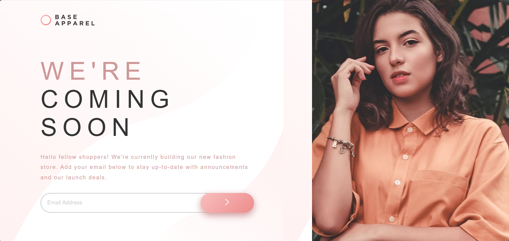

# Frontend Mentor - Base Apparel coming soon page solution

This is a solution to the [Base Apparel coming soon page](https://www.frontendmentor.io/challenges/base-apparel-coming-soon-page-5d46b47f8db8a7063f9331a0). Frontend Mentor challenges help you improve your coding skills by building realistic projects.

## Table of contents

- [Overview](#overview)
  - [The challenge](#the-challenge)
  - [Screenshot](#screenshot)
  - [Links](#links)
- [My process](#my-process)
  - [Built with](#built-with)
  - [Continued development](#continued-development)
- [Author](#author)

**Note: Delete this note and update the table of contents based on what sections you keep.**

## Overview

### The challenge

Users should be able to:

- View the optimal layout for the site depending on their device's screen size
- See hover states for all interactive elements on the page
- Receive an error message when the `form` is submitted if:
  - Any `input` field is empty. The message for this error should say _"[Field Name] cannot be empty"_
  - The email address is not formatted correctly (i.e. a correct email address should have this structure: `name@host.tld`). The message for this error should say _"Looks like this is not an email"_

### Screenshot

### Links

- Solution URL: [Github repository](https://github.com/EJMK18/FEM---base-apparel-coming-soon)
- Live Site URL: [Vercel - Live site deployed](https://fem-base-apparel-coming-soon-five.vercel.app/)

## My process

### Built with

- Semantic HTML5 markup
- CSS custom properties
- Flexbox
- CSS Grid (minimal)
- JavaScript (minimal)

### Continued development

Currently, I am focused on improving writing code using vanilla front end technologies (HTML, CSS, and JavaScript) before utilising frontend frameworks. Once I feel more comfortable with these technologies, I will gradually add frameworks to my learning stack.

## Author

- Frontend Mentor - [@Evan Munnik](https://www.frontendmentor.io/profile/EJMK18)
